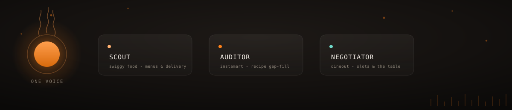
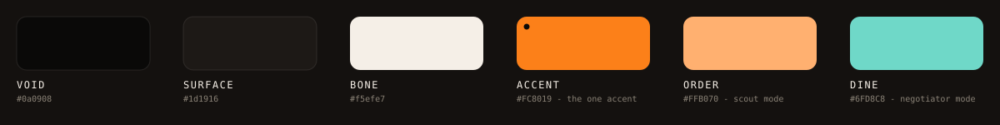

# 🍳 Kitchen Copilot

### an executive assistant for the kitchen.

one voice in, dinner sorted. cook, order in, or head out — say it once and
Kitchen Copilot routes you to the right Swiggy surface and gets it done,
hands-free, while you're still holding a spatula.

<p>
  
  
  
  
  
  
  
</p>



---

## see it in action

<video src="https://github.com/user-attachments/assets/b9bab23d-7eca-4461-824c-ffe48b845bf9" controls muted playsinline width="100%"></video>

<sub>"are we cooking, ordering, or heading out" → butter chicken's missing three things,
a table's booked at Toscano for 7:30, and a biryani order is on its way — all one conversation.</sub>

---

## the idea

"what's for dinner" is a daily tax on your attention, and every existing
answer makes it worse — a recipe app, a grocery app, a delivery app, a
reservations app, four tabs and zero of them talk to each other. Kitchen
Copilot collapses that into one conversation. You don't open a menu, you
don't tap a cart, you don't type anything with wet hands mid-recipe — you
just say what you want and it happens.

It isn't a chatbot bolted onto Swiggy. It's one voice that actually knows
food — opinionated about which biryani place is worth it, quick to warn you
before it clears your cart, quietly anticipating the thing you didn't ask
for yet ("want me to flag a dessert spot for after?"). The personality is
the product as much as the plumbing is.

## what it actually does

- **Scout** (Swiggy Food) — doesn't just list restaurants, reads their
  menus. "Spicy wings under ₹400" matches on what a place actually *serves*,
  not just its name. Warns you before switching restaurants wipes your cart,
  and won't let a cart quietly sail past the ₹1000 cap.
- **Auditor** (Swiggy Instamart) — tell it what you're cooking, it knows the
  ingredient list, checks what's missing, and picks the *smallest* in-stock
  pack for what you actually need — a 2-onion recipe gets a 500g bag, not a
  1kg one nobody asked for. Reads back the basket and total before it ever
  checks out.
- **Negotiator** (Swiggy Dineout) — books the table directly when you give
  it a time, quietly checks ±30 minutes of flex when that slot's gone, and
  falls back to "same vibe, open tonight" when the whole restaurant is
  booked out.
- **A hard stop before anything spends money.** Booking a table, checking
  out a cart, placing an order — every one of those pauses on a real
  confirmation card and waits for a tap. Not a prompt asking nicely: an
  actual code-level gate the model cannot talk its way around.
- **A person, not a script.** No "certainly!", no "I'd be happy to help" —
  a voice with actual taste, that remembers what you said ten minutes ago,
  and speaks whatever language you switch to mid-sentence.

## our colors

near-black and one loud accent — Swiggy's own orange, used the way a pilot
light is used: small, warm, always on. the scene itself shifts hue with
whatever you're doing — warm orange while you cook, a soft peach while you
order, a cool teal while you're out — so the color on screen is always
telling you which of the three assistants is listening.



---

## under the hood

<details>
<summary><strong>expand for the technical side</strong> — architecture, stack, and how to run it</summary>

<br>

### how it thinks

the interesting engineering isn't the AI part — it's everything wrapped
around it to make an AI trustworthy enough to spend your money.

```
you talk ──────▶ ① OpenAI Realtime (native STT + reasoning + TTS, one model)
                       │  hears you over WebRTC, reasons against the
                       │  persona + all 35 Swiggy tool schemas, decides:
                       │  speak, call a tool, or both
                       ▼
                   ② tool router (pure code, one chokepoint)
                       │  validates args, resolves mock vs. real Swiggy
                       │  MCP by env, and is the ONLY place any tool call
                       │  can pass through
                       ▼
                   ③ consent gate — mutations only
                       │  book_table / checkout / place_food_order
                       │  literally suspend mid-call behind a Promise
                       │  until a confirmation card is tapped
                       ▼
               Swiggy Food · Instamart · Dineout, actually executed
```

a few choices worth knowing about, not just having read once:

- **the safety rail lives in code, not in the prompt.** the three tools
  that spend money or make a booking are intercepted before they ever
  fire — a confirmation card renders, and the underlying tool call is
  paused on an unresolved promise until a human taps it. the model can't
  distinguish "the user declined" from "the tool failed" — both just come
  back as an error it has to talk through, which is the point.
- **push-to-talk, not always-listening.** no server-side voice activity
  detection deciding when you're done talking — that was chopping
  sentences and causing the agent to self-interrupt on its own speaker
  bleed. the client commits the turn explicitly.
- **the orb doesn't trust the model's own "I'm done talking" event.**
  server events land 200–500ms before the buffered audio actually
  finishes playing, so "is the agent audible right now" is read straight
  off a live Web Audio analyser instead, with attack/release smoothing so
  a natural mid-sentence pause doesn't flicker the whole UI.
- **cards are rendered by a pure function, not the model.** every tool
  result passes through a mapper that decides what — if anything — lights
  up on screen, independent of whatever the model chooses to say. what's
  on screen always matches the "read at most 3 things aloud" rule, because
  they're generated from the same slice of data.
- **the system prompt *is* the product.** the mock data and the tool
  router are scaffolding; the persona, the module playbooks (Scout /
  Auditor / Negotiator), and every "when X, do Y" edge case live in one
  markdown file under version control, not scattered across code.

### stack

| layer | what's actually running |
|---|---|
| framework | Next.js 16 (App Router), React 19, TypeScript |
| styling | Tailwind v4, Framer Motion, a dark-only "liquid glass" theme |
| voice | OpenAI Realtime API (GA `gpt-realtime`) over WebRTC — native speech-in, reasoning, and speech-out, voice `sage`; no separate STT/TTS |
| tool protocol | Model Context Protocol (MCP) against Swiggy's Food, Instamart, and Dineout servers |
| mock layer | in-memory store + JSON fixtures — full 35/35 tool coverage, so the entire product runs and demos without production Swiggy credentials |
| auth | OAuth 2.1 + PKCE, tokens in HttpOnly cookies only — never localStorage, never logged |
| safety | pre-mutation confirmation gate + a hard `LIVE_MUTATIONS` kill-switch on the 3 non-idempotent tools |

### running it

```bash
cp .env.example .env.local   # fill in OPENAI_API_KEY — mock mode needs nothing else
npm install
npm run dev                  # http://localhost:3000/voice
```

Point it at the real Swiggy MCP once you have credentials by flipping
`SWIGGY_MODE=real` (and, deliberately, `LIVE_MUTATIONS=true` only when
you actually mean it).

```bash
npm test                     # typecheck + every test suite below
```

### map of the repo

```
app/
  api/voice/session/      mints the ephemeral OpenAI Realtime token
  api/tools/[server]/     the tool router's HTTP surface
  api/auth/swiggy/        OAuth 2.1 + PKCE
  voice/                  the app — orb, transcript, cards, panel
components/
  cards/                  restaurant / instamart / delivery cards + the confirmation sheet
  negotiator/             the Dineout slot-picker panel
  voice/                  the Aura orb, transcript stream, push-to-talk button
lib/
  voice/                  Realtime session config — persona + tool surface
  agent/                  event reducer, tool→card mapper, consent gate, turn control
  mcp/                    tool router, MCP client, OAuth, the kill-switch
  mock/                   full mock implementation of all 35 Swiggy tools
agent/prompts/            system.md — the persona + module rules. the actual product.
data/mock/                JSON fixtures backing the mock layer
scripts/                  the test suites
docs/                     the original PRD
```

</details>

<br>

<sub>built on a few too many biryani cravings<span style="color:#FC8019">.</span></sub>
